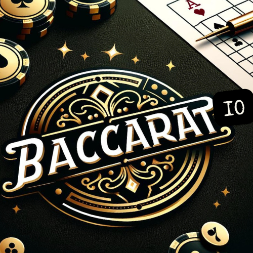

# 🃏 TruHoldem

[](https://github.com/APorkolab/TruHoldem/actions/workflows/ci-cd.yml)
[](https://codecov.io/gh/APorkolab/TruHoldem)
[](https://opensource.org/licenses/MIT)
[](https://openjdk.org/projects/jdk/21/)
[](https://spring.io/projects/spring-boot)
[](https://angular.io/)

**A production-ready Texas Hold'em poker platform with advanced Bot AI, multi-table tournaments, real-time WebSocket gameplay, and comprehensive observability.**

> 🎯 **Portfolio Project** — Demonstrates senior-level full-stack development with enterprise-grade architecture patterns, comprehensive test coverage (2,500+ tests), and production-ready DevOps infrastructure.

<p align="center">
  
</p>

---

## ✨ Features

### Core Gameplay
- **Real-time multiplayer** — WebSocket-based gameplay with instant updates
- **Complete Texas Hold'em rules** — Pre-flop, flop, turn, river betting rounds
- **Side pot management** — Automatic handling of all-in situations with multiple side pots
- **Hand evaluation** — Full poker hand ranking from high card to royal flush
- **Official poker rules** — Dead button handling, showdown order (last aggressor first), missed blinds tracking
- **Short all-in support** — Players can go all-in even if they can't afford minimum raise

### Tournament System
- **Multi-table tournaments** — Dynamic table balancing and player redistribution
- **Sit & Go / Scheduled** — Multiple tournament formats with configurable parameters
- **Blind structures** — Standard, Turbo, and Deep stack configurations
- **Rebuy/Add-on** — Configurable rebuy periods and limits
- **Prize distribution** — Automatic payout calculation with customizable structures

### Advanced Bot AI
- **Monte Carlo simulation** — 500-iteration equity calculations for decision making
- **Position awareness** — Strategic adjustments based on table position
- **Multiple personalities** — Tight-Aggressive, Loose-Aggressive, Tight-Passive, Loose-Passive
- **Opponent modeling** — Tracks and adapts to opponent betting patterns
- **Pot odds & implied odds** — Mathematical decision framework
- **All-in decision making** — Smart call/fold logic when facing all-in bets based on hand strength and pot odds

### Analytics & Statistics
- **Equity calculator** — Real-time hand vs. hand equity analysis
- **Hand history** — Complete game replay with action-by-action breakdown
- **Player statistics** — VPIP, PFR, aggression factor, win rates
- **Leaderboards** — Global and tournament-specific rankings

### Enterprise Features
- **JWT authentication** — Secure token-based auth with refresh tokens
- **WebSocket clustering** — Redis-backed horizontal scaling support
- **Rate limiting** — Configurable request throttling
- **Distributed tracing** — OpenTelemetry integration with Jaeger
- **Metrics & monitoring** — Prometheus metrics with Grafana dashboards
- **API versioning** — Clean REST API with OpenAPI documentation

---

## 🛠 Tech Stack

### Backend
| Technology | Version | Purpose |
|------------|---------|---------|
| Java | 21 | Language (LTS with virtual threads) |
| Spring Boot | 3.5 | Application framework |
| Spring Security | 6.x | Authentication & authorization |
| Spring WebSocket | STOMP | Real-time communication |
| Spring Data JPA | Hibernate | Data persistence |
| PostgreSQL | 16 | Primary database |
| Redis | 7 | Caching & WebSocket sessions |
| Liquibase | 4.x | Database migrations |
| OpenTelemetry | 1.36 | Distributed tracing |
| Micrometer | Prometheus | Metrics collection |

### Frontend
| Technology | Version | Purpose |
|------------|---------|---------|
| Angular | 20 | SPA framework |
| NgRx ComponentStore | 20 | Reactive state management |
| RxJS | 7.8 | Reactive programming |
| Bootstrap | 5.3 | UI components |
| Jest | 30 | Unit testing |
| Cypress | 13 | E2E testing |
| axe-core | 4.11 | Accessibility testing |

### DevOps
| Technology | Purpose |
|------------|---------|
| Docker & Docker Compose | Containerization |
| GitHub Actions | CI/CD pipeline |
| Nginx | Reverse proxy & static serving |
| Prometheus | Metrics aggregation |
| Grafana | Monitoring dashboards |
| Jaeger | Distributed tracing |
| OpenTelemetry Collector | Telemetry pipeline |

---

## 🚀 Quick Start

### Prerequisites
- Docker & Docker Compose
- Java 21+ (for local development)
- Node.js 20-22 (for local development, Node.js 24+ may have webpack compatibility issues)
- PostgreSQL 16 (or use Docker)
- Redis 7 (optional, for WebSocket clustering)

### Docker (Recommended)

```bash
# Clone the repository
git clone https://github.com/APorkolab/TruHoldem.git
cd TruHoldem

# Start all services
docker-compose up -d

# Access the application
# Frontend:     http://localhost:4200
# API:          http://localhost:8080/api
# Swagger UI:   http://localhost:8080/api/swagger-ui.html
# Grafana:      http://localhost:3000 (admin/admin)
# Jaeger:       http://localhost:16686
# Prometheus:   http://localhost:9090
```

### Local Development

```bash
# Recommended: Use the dev-start script (auto-finds available port)
./scripts/dev-start.sh

# Or start manually:

# Backend (Terminal 1)
cd backend
./mvnw spring-boot:run -Dspring-boot.run.profiles=dev

# Frontend (Terminal 2)
cd frontend
npm install
npm run dev
```

#### Development Script Options

```bash
# Start both backend and frontend
./scripts/dev-start.sh

# Start frontend only (if backend is already running)
./scripts/dev-start.sh --frontend-only
```

#### Clearing Cache (if webpack errors occur)

```bash
cd frontend
rm -rf node_modules/.cache .angular
npm cache clean --force
npm run dev
```

---

## 📁 Project Structure

```
TruHoldem/
├── backend/                    # Spring Boot application
│   ├── src/main/java/com/truholdem/
│   │   ├── config/            # Configuration classes
│   │   ├── controller/        # REST & WebSocket controllers
│   │   ├── domain/            # DDD aggregates, events, value objects
│   │   ├── dto/               # Data transfer objects
│   │   ├── exception/         # Custom exceptions & handlers
│   │   ├── model/             # JPA entities
│   │   ├── observability/     # Metrics, tracing, logging
│   │   ├── repository/        # Data access layer
│   │   ├── security/          # JWT & authentication
│   │   ├── service/           # Business logic
│   │   └── websocket/         # WebSocket infrastructure
│   └── src/test/              # Test suites (1,000+ tests)
│
├── frontend/                   # Angular application
│   ├── src/app/
│   │   ├── analysis/          # Equity calculator, range builder
│   │   ├── auth/              # Login/register components
│   │   ├── game-table/        # Main game interface
│   │   ├── guards/            # Route protection
│   │   ├── hand-replay/       # History playback
│   │   ├── services/          # API & state services
│   │   ├── store/             # NgRx ComponentStore
│   │   └── tournament/        # Tournament components
│   └── cypress/               # E2E tests (190+ tests)
│
├── docker/                    # Docker configurations
│   ├── grafana/              # Dashboard definitions
│   └── prometheus/           # Alert rules
│
├── monitoring/               # Observability configs
└── docs/                     # Documentation
```

---

## 🏗 Architecture

```
┌─────────────────────────────────────────────────────────────────┐
│                         Client Layer                            │
│  ┌─────────────┐  ┌─────────────┐  ┌─────────────────────────┐  │
│  │   Angular   │  │   Mobile    │  │   Third-party Clients   │  │
│  │     SPA     │  │   (Future)  │  │      (API consumers)    │  │
│  └──────┬──────┘  └──────┬──────┘  └───────────┬─────────────┘  │
└─────────┼────────────────┼─────────────────────┼────────────────┘
          │ HTTP/WS        │                     │ REST API
          ▼                ▼                     ▼
┌─────────────────────────────────────────────────────────────────┐
│                        API Gateway (Nginx)                      │
│         Load Balancing │ SSL Termination │ Rate Limiting        │
└─────────────────────────────┬───────────────────────────────────┘
                              │
┌─────────────────────────────┼───────────────────────────────────┐
│                    Application Layer                            │
│  ┌──────────────────────────┴────────────────────────────────┐  │
│  │                    Spring Boot Backend                    │  │
│  │  ┌─────────────┐  ┌─────────────┐  ┌─────────────────────┐│  │
│  │  │ REST APIs   │  │  WebSocket  │  │  Background Jobs    ││  │
│  │  │ (Games,     │  │  (STOMP)    │  │  (Tournaments,      ││  │
│  │  │ Tournaments)│  │  Real-time  │  │   Blind increases)  ││  │
│  │  └──────┬──────┘  └──────┬──────┘  └──────────┬──────────┘│  │
│  │         │                │                     │          │  │
│  │  ┌──────┴────────────────┴─────────────────────┴────────┐ │  │
│  │  │              Service Layer (Business Logic)          │ │  │
│  │  │  PokerGameService │ TournamentService │ BotAIService │ │  │
│  │  └───────────────────────────┬──────────────────────────┘ │  │
│  │                              │                            │  │
│  │  ┌───────────────────────────┴───────────────────────────┐│  │
│  │  │           Domain Layer (DDD Patterns)                 ││  │
│  │  │  Aggregates │ Value Objects │ Domain Events           ││  │
│  │  └───────────────────────────────────────────────────────┘│  │
│  └───────────────────────────────────────────────────────────┘  │
└─────────────────────────────┬───────────────────────────────────┘
                              │
┌─────────────────────────────┼───────────────────────────────────┐
│                      Data Layer                                 │
│  ┌─────────────┐  ┌─────────────┐  ┌───────────────────────────┐│
│  │ PostgreSQL  │  │    Redis    │  │     Message Queues        ││
│  │  (Primary   │  │  (Sessions, │  │  (Domain Events via       ││
│  │   Storage)  │  │   Caching)  │  │   Spring Events)          ││
│  └─────────────┘  └─────────────┘  └───────────────────────────┘│
└─────────────────────────────────────────────────────────────────┘
                              │
┌─────────────────────────────┼───────────────────────────────────┐
│                   Observability Layer                           │
│  ┌─────────────┐  ┌─────────────┐  ┌───────────────────────────┐│
│  │ Prometheus  │  │   Jaeger    │  │    Grafana Dashboards     ││
│  │  (Metrics)  │  │  (Traces)   │  │    (Visualization)        ││
│  └─────────────┘  └─────────────┘  └───────────────────────────┘│
└─────────────────────────────────────────────────────────────────┘
```

---

## 🧪 Testing

### Test Coverage Summary

| Layer | Tests | Coverage |
|-------|-------|----------|
| Backend Unit/Integration | 1,064 | 85%+ |
| Frontend Unit (Jest) | 1,255 | 80%+ |
| E2E (Cypress) | 194 | Critical paths |
| **Total** | **2,513** | — |

### Running Tests

```bash
# Backend tests
cd backend
./mvnw verify

# Frontend unit tests
cd frontend
npm run test:ci

# Frontend E2E tests
npm run e2e:ci

# All tests
npm run test:all
```

### Test Categories
- **Unit tests** — Service logic, domain objects, utilities
- **Integration tests** — Repository, controller, WebSocket
- **Architecture tests** — Package dependency validation (ArchUnit)
- **E2E tests** — Complete user flows, accessibility (axe-core)

---

## 🤖 Bot AI System

The bot AI uses a sophisticated decision-making framework:

```
┌────────────────────────────────────────────────────────────────┐
│                    Bot Decision Pipeline                       │
├────────────────────────────────────────────────────────────────┤
│  1. Hand Strength Calculation                                  │
│     └─ Monte Carlo: 500 iterations for equity estimation       │
│                                                                │
│  2. Position Analysis                                          │
│     └─ Early/Middle/Late/Button position scoring               │
│                                                                │
│  3. Pot Odds Calculation                                       │
│     └─ pot_odds = to_call / (pot + to_call)                    │
│                                                                │
│  4. Personality Adjustment                                     │
│     ├─ Tight-Aggressive  (TAG): Premium hands, big bets        │
│     ├─ Loose-Aggressive  (LAG): Wide range, pressure           │
│     ├─ Tight-Passive     (TP):  Premium hands, calls           │
│     └─ Loose-Passive     (LP):  Wide range, passive            │
│                                                                │
│  5. Action Selection                                           │
│     └─ Pre-flop strategy │ Post-flop strategy │ Bluff logic    │
└────────────────────────────────────────────────────────────────┘
```

📖 See [docs/BOT_AI.md](docs/BOT_AI.md) for detailed documentation.

---

## 📚 Documentation

| Document | Description |
|----------|-------------|
| [ARCHITECTURE.md](docs/ARCHITECTURE.md) | System architecture & design decisions |
| [BOT_AI.md](docs/BOT_AI.md) | Bot AI strategy & algorithms |
| [TOURNAMENTS.md](docs/TOURNAMENTS.md) | Tournament system documentation |
| [ANALYSIS.md](docs/ANALYSIS.md) | Hand analysis & equity calculator |
| [DEPLOYMENT.md](docs/DEPLOYMENT.md) | Production deployment guide |
| [CONTRIBUTING.md](CONTRIBUTING.md) | Contribution guidelines |

---

## 🔌 API Documentation

Interactive API documentation is available via Swagger UI:

```
http://localhost:8080/api/swagger-ui.html
```

### Key Endpoints

| Method | Endpoint | Description |
|--------|----------|-------------|
| `POST` | `/api/v2/games` | Create new game |
| `POST` | `/api/v2/games/{id}/join` | Join a game |
| `POST` | `/api/v2/games/{id}/action` | Perform game action |
| `GET` | `/api/v2/tournaments` | List tournaments |
| `POST` | `/api/v2/tournaments` | Create tournament |
| `POST` | `/api/v2/analysis/equity` | Calculate equity |
| `GET` | `/api/v2/statistics/leaderboard` | Get leaderboard |

---

## 🚢 Deployment

### Docker Compose (Development/Staging)
```bash
docker-compose up -d
```

### Production Checklist
- [ ] Configure external PostgreSQL/Redis
- [ ] Set secure JWT secrets
- [ ] Configure SSL certificates
- [ ] Set up proper CORS origins
- [ ] Enable rate limiting
- [ ] Configure log aggregation
- [ ] Set up alerting rules

📖 See [docs/DEPLOYMENT.md](docs/DEPLOYMENT.md) for detailed guide.

---

## 📊 Monitoring

### Pre-configured Grafana Dashboards
- **Game Metrics** — Active games, actions/second, hand completion times
- **Tournament Metrics** — Active tournaments, player counts, prize pools
- **System Health** — JVM metrics, HTTP latency, error rates
- **WebSocket Cluster** — Connection counts, message throughput

### Prometheus Alerts
- High error rate (>5% over 5 minutes)
- Slow response times (>1s p95 latency)
- Database connection pool exhaustion
- Memory pressure warnings

---

## 🛣 Roadmap

### Completed
- [x] Official poker rules (dead button, showdown order, missed blinds)
- [x] Short all-in support per official rules
- [x] Advanced bot AI with all-in handling
- [x] Dark theme raise modal

### Planned
- [ ] Mobile-responsive redesign
- [ ] Multi-currency support
- [ ] Advanced hand range visualization
- [ ] AI-powered hand review
- [ ] Kubernetes deployment manifests
- [ ] Integration with poker training tools
- [ ] Player avatars and customization
- [ ] Chat functionality
- [ ] Hand history export (PokerStars format)

---

## 📄 License

This project is licensed under the MIT License — see the [LICENSE](LICENSE) file for details.

---

## 👤 Author

**Adam Porkolab**  
Senior Full-Stack Engineer | Java/Spring Boot & Angular Specialist

- 🌐 [Portfolio](https://www.aporkolab.com)
- 💼 [LinkedIn](https://linkedin.com/in/adamporkolab)
- 📧 [Email](mailto:ap@aporkolab.com)

---

<p align="center">
  Made with ❤️ and ☕ — <i>Because every hand tells a story</i>
</p>
